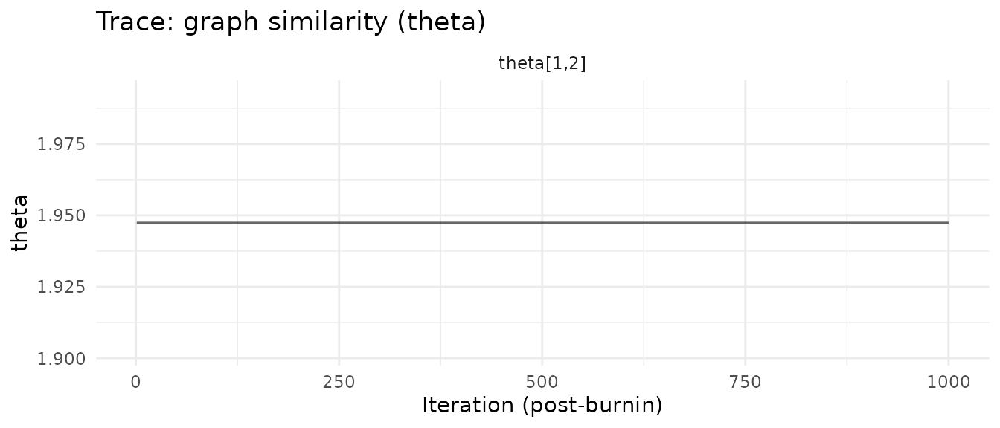
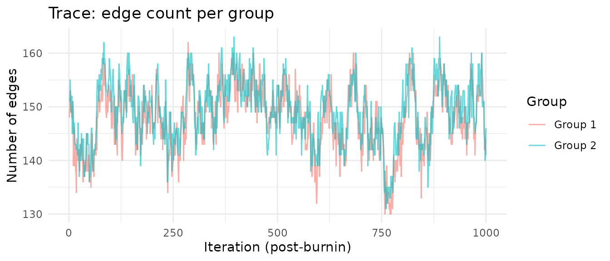
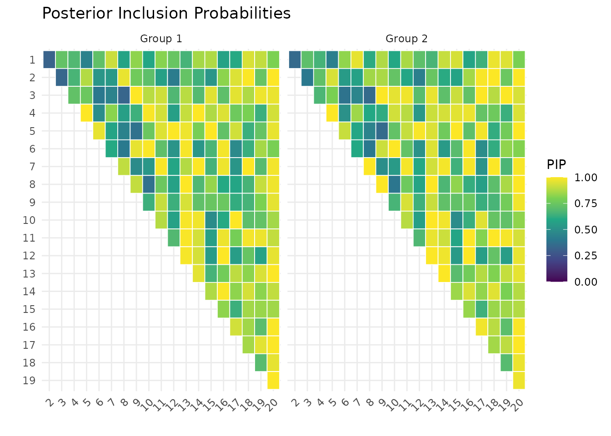
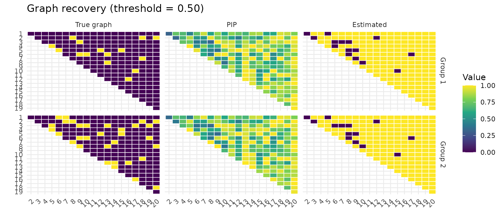
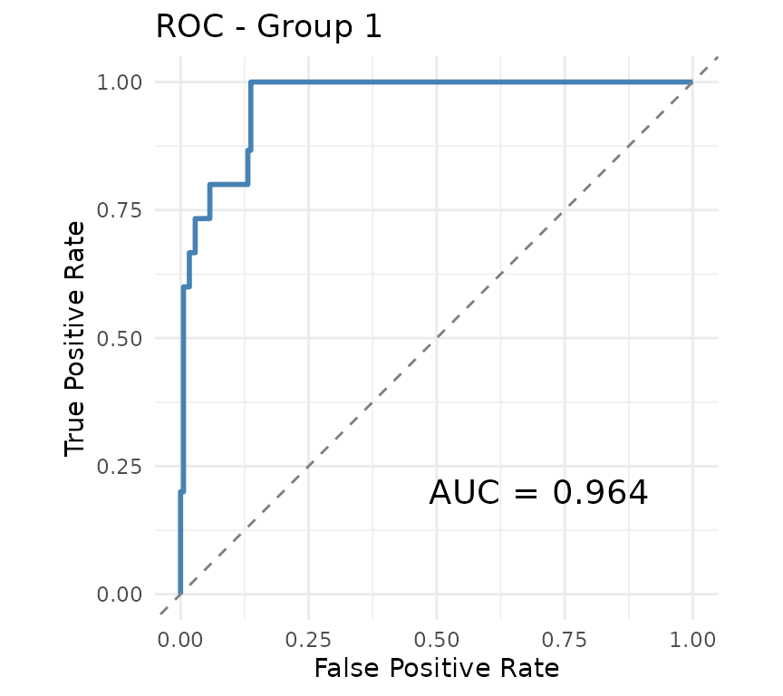
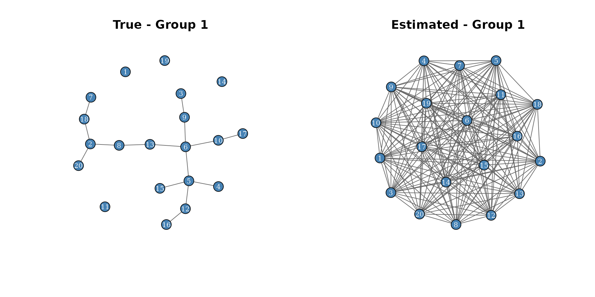
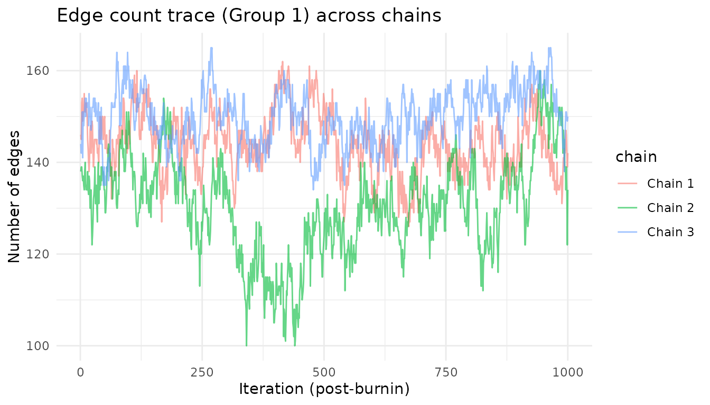
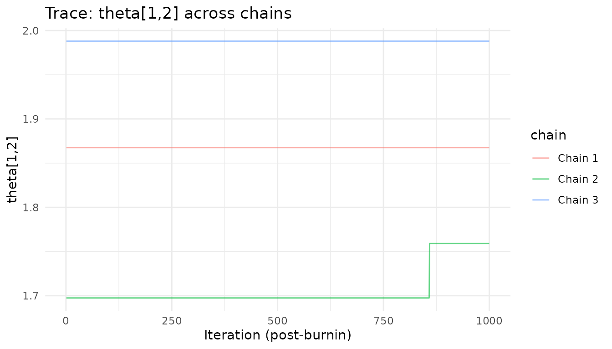

# Getting Started with multiGGM

## Introduction

The **multiGGM** package implements the Bayesian method of Peterson,
Stingo & Vannucci (2015, *JASA*) for joint inference of multiple
Gaussian graphical models (GGMs). Given data from $`K`$ groups, the
method simultaneously estimates group-specific precision matrices
$`\Omega_k`$ and their associated conditional independence graphs
$`G_k`$, while borrowing strength across groups through a Markov random
field (MRF) prior.

This vignette walks through:

1.  Simulating multi-group data with known graph structure
2.  Fitting the model with
    [`multiggm_mcmc()`](https://mljaniczek.github.io/multiGGMr/reference/multiggm_mcmc.md)
3.  Checking convergence
4.  Extracting and interpreting results
5.  Comparing estimated graphs to ground truth
6.  Running and summarizing multiple MCMC chains

## 1. Simulate data

We generate data from two groups with $`p = 15`$ variables and
$`n = 100`$ observations each, using a banded (AR-2) graph structure.

``` r

library(multiGGM)

sim <- simulate_multiggm(
  K = 2, p = 20, n = 100,
  graph_type = "random",
  perturb_prob = 0.1,
  seed = 42
)

cat("True edge counts:\n")
#> True edge counts:
for (k in 1:sim$K) {
  adj_k <- sim$adj_list[[k]]
  cat(sprintf("  Group %d: %d edges\n", k, sum(adj_k[upper.tri(adj_k)])))
}
#>   Group 1: 15 edges
#>   Group 2: 32 edges
```

## 2. Fit the model

We pass raw data matrices directly. The function computes cross-product
matrices internally after column-centering.

``` r

fit <- multiggm_mcmc(
  data_list = sim$data_list,
  burnin = 2000,
  nsave = 1000,
  thin = 1,
  seed = 123
)
```

``` r

fit
#> <multiggm_fit>
#>   K groups: 2 
#>   p nodes : 20 
#>   Posterior draws: 1000
```

## 3. Check convergence

### Summary

The [`summary()`](https://rdrr.io/r/base/summary.html) method reports
acceptance rates and edge counts. Acceptance rates between 20-60% are
generally healthy.

``` r

summary(fit, pip_threshold = .3)
#> multiGGM MCMC Summary
#> =====================
#> Groups (K): 2   |  Nodes (p): 20   |  Posterior draws: 1000 
#> 
#> Acceptance rates:
#>   gamma (edge toggle): 0.1% 
#>   theta (within-model): 1.2% 
#>   nu (edge log-odds): 67.2% 
#> 
#> Selected edges (PIP >= 0.3 ):
#>   Group 1 : 190 edges
#>   Group 2 : 190 edges
#> 
#> Graph similarity (theta):
#>   theta[1,2]: mean = 1.947, P(nonzero) = 100.0%
```

### Trace plots

Trace plots help assess mixing. The theta trace shows the graph
similarity parameter – values above zero indicate the model is borrowing
strength across groups.

``` r

plot(fit, type = "trace_theta")
```



``` r

plot(fit, type = "trace_edges")
```



## 4. Extract results

### Posterior inclusion probabilities (PIP)

PIPs indicate how often each edge was included across posterior samples.
Higher PIP = stronger evidence for that edge.

``` r

pip <- pip_edges(fit)
```

``` r

plot(fit, type = "pip")
```



### Estimated precision and partial correlations

The [`coef()`](https://rdrr.io/r/stats/coef.html) method returns
posterior mean precision matrices, while
[`fitted()`](https://rdrr.io/r/stats/fitted.values.html) returns
posterior mean partial correlations.

``` r

omega_hat <- coef(fit)
cat("Posterior mean precision (Group 1, first 5x5 block):\n")
#> Posterior mean precision (Group 1, first 5x5 block):
round(omega_hat[[1]][1:5, 1:5], 3)
#>        [,1]   [,2]   [,3]   [,4]   [,5]
#> [1,]  1.450 -0.029 -0.131 -0.120  0.031
#> [2,] -0.029  1.115  0.011  0.068  0.129
#> [3,] -0.131  0.011  1.242 -0.187 -0.112
#> [4,] -0.120  0.068 -0.187  1.919  0.746
#> [5,]  0.031  0.129 -0.112  0.746  1.598
```

``` r

pcor_hat <- fitted(fit)
cat("Posterior mean partial correlations (Group 1, first 5x5 block):\n")
#> Posterior mean partial correlations (Group 1, first 5x5 block):
round(pcor_hat[[1]][1:5, 1:5], 3)
#>        [,1]   [,2]   [,3]   [,4]   [,5]
#> [1,]  1.000  0.023  0.097  0.071 -0.020
#> [2,]  0.023  1.000 -0.009 -0.046 -0.097
#> [3,]  0.097 -0.009  1.000  0.119  0.078
#> [4,]  0.071 -0.046  0.119  1.000 -0.425
#> [5,] -0.020 -0.097  0.078 -0.425  1.000
```

### Credible intervals

``` r

pcor_draws <- posterior_pcor(fit)
ci <- posterior_ci(pcor_draws)

# Example: 95% CI for edge (1,2) in group 1
cat(sprintf("pcor[1,2] Group 1: %.3f (%.3f, %.3f)\n",
            ci$median[1, 2, 1], ci$lower[1, 2, 1], ci$upper[1, 2, 1]))
#> pcor[1,2] Group 1: -0.000 (-0.059, 0.194)
```

## 5. Compare to ground truth

### Visual comparison

[`plot_recovery()`](https://mljaniczek.github.io/multiGGMr/reference/plot_recovery.md)
shows the true graph, PIP heatmap, and thresholded estimate
side-by-side.

``` r

cm <- plot_recovery(fit, sim$adj_list, pip_threshold = 0.5)
```



### Confusion metrics

``` r

for (k in seq_along(cm)) {
  cat(sprintf("Group %d: TP=%d, FP=%d, FN=%d, TN=%d, TPR=%.2f, FPR=%.2f\n",
              k, cm[[k]]["TP"], cm[[k]]["FP"], cm[[k]]["FN"], cm[[k]]["TN"],
              cm[[k]]["TPR"], cm[[k]]["FPR"]))
}
#> Group 1: TP=15, FP=160, FN=0, TN=15, TPR=1.00, FPR=0.91
#> Group 2: TP=32, FP=144, FN=0, TN=14, TPR=1.00, FPR=0.91
```

### ROC curve

The ROC curve evaluates edge selection across all possible thresholds.

``` r

roc1 <- roc_auc(pip[, , 1], sim$adj_list[[1]])
plot_roc(roc1, main = "ROC - Group 1")
```



## 6. Network visualization

We can visualize the estimated graph as a network.

``` r

par(mfrow = c(1, 2))
plot_network(sim$adj_list[[1]], main = "True - Group 1", vertex_size = 12)
est_adj <- (pip[, , 1] >= 0.3) * 1L
plot_network(est_adj, main = "Estimated - Group 1", vertex_size = 12)
```



## 7. Differential edges

For $`K = 2`$ groups, we can identify edges that differ between groups.

``` r

pip_diff <- pip_diff_edge(fit)
cat("Edges with P(differential) > 0.5:",
    sum(pip_diff[upper.tri(pip_diff)] > 0.5), "\n")
#> Edges with P(differential) > 0.5: 0
```

``` r

pcor_draws <- posterior_pcor(fit)
diff_prob <- diff_prob_pcor(pcor_draws, delta = 0.1)
cat("Edges with P(|pcor diff| > 0.1) > 0.5:",
    sum(diff_prob[upper.tri(diff_prob)] > 0.5), "\n")
#> Edges with P(|pcor diff| > 0.1) > 0.5: 87
```

## 8. Running multiple chains

Running multiple MCMC chains from different starting points is important
for assessing convergence. The
[`multiggm_mcmc()`](https://mljaniczek.github.io/multiGGMr/reference/multiggm_mcmc.md)
function supports this via the `nchains` argument. Chains can be run in
parallel with `parallel = TRUE`.

### Fitting multiple chains

``` r

fit_mc <- multiggm_mcmc(
  data_list = sim$data_list,
  burnin    = 2000,
  nsave     = 1000,
  nchains   = 3,
  parallel  = TRUE,
  seed      = 42
)
```

The result is a `multiggm_fit_list` object containing all chains:

``` r

fit_mc
#> <multiggm_fit_list>
#>   Chains: 3 
#>   K groups: 2
```

### Accessing individual chains

Each chain is a full `multiggm_fit` object. Access them via `$chains`:

``` r

# Summary of chain 1
summary(fit_mc$chains[[1]], pip_threshold = 0.3)
#> multiGGM MCMC Summary
#> =====================
#> Groups (K): 2   |  Nodes (p): 20   |  Posterior draws: 1000 
#> 
#> Acceptance rates:
#>   gamma (edge toggle): 0.2% 
#>   theta (within-model): 3.6% 
#>   nu (edge log-odds): 61.7% 
#> 
#> Selected edges (PIP >= 0.3 ):
#>   Group 1 : 186 edges
#>   Group 2 : 186 edges
#> 
#> Graph similarity (theta):
#>   theta[1,2]: mean = 1.868, P(nonzero) = 100.0%
```

Most utility functions accept a `chain` argument to select which chain
to analyze:

``` r

# PIPs from chain 1 vs chain 2
pip_c1 <- pip_edges(fit_mc, chain = 1)
pip_c2 <- pip_edges(fit_mc, chain = 2)

idx <- upper.tri(pip_c1[, , 1])
cat(sprintf("PIP correlation between chain 1 and 2 (Group 1): %.3f\n",
            cor(pip_c1[, , 1][idx], pip_c2[, , 1][idx])))
#> PIP correlation between chain 1 and 2 (Group 1): 0.832
```

### Comparing trace plots across chains

Overlaying trace plots from multiple chains is one of the most effective
visual convergence diagnostics. Chains that have converged will mix and
overlap, while chains stuck in different modes will show persistent
separation.

``` r

library(ggplot2)

# Build a combined edge-count trace from all chains
trace_df <- do.call(rbind, lapply(seq_len(fit_mc$nchains), function(ch) {
  ec <- edge_counts(fit_mc, chain = ch)
  data.frame(
    iteration = seq_len(nrow(ec)),
    edges     = ec[, 1],
    chain     = paste("Chain", ch),
    stringsAsFactors = FALSE
  )
}))

ggplot(trace_df, aes(x = iteration, y = edges, color = chain)) +
  geom_line(alpha = 0.6) +
  labs(title = "Edge count trace (Group 1) across chains",
       x = "Iteration (post-burnin)", y = "Number of edges") +
  theme_minimal()
```



``` r

# Overlay theta traces from all chains
theta_df <- do.call(rbind, lapply(seq_len(fit_mc$nchains), function(ch) {
  data.frame(
    iteration = seq_len(dim(fit_mc$chains[[ch]]$Theta_save)[3]),
    theta     = fit_mc$chains[[ch]]$Theta_save[1, 2, ],
    chain     = paste("Chain", ch),
    stringsAsFactors = FALSE
  )
}))

ggplot(theta_df, aes(x = iteration, y = theta, color = chain)) +
  geom_line(alpha = 0.6) +
  labs(title = "Trace: theta[1,2] across chains",
       x = "Iteration (post-burnin)", y = "theta[1,2]") +
  theme_minimal()
```



### Pooling results across chains

To combine posterior samples from all chains, concatenate the saved
arrays along the iteration dimension:

``` r

# Pool precision draws across all chains
pool_C <- abind::abind(
  lapply(fit_mc$chains, function(ch) ch$C_save),
  along = 4
)
cat(sprintf("Pooled draws: %d (from %d chains x %d draws each)\n",
            dim(pool_C)[4], fit_mc$nchains, dim(fit_mc$chains[[1]]$C_save)[4]))
#> Pooled draws: 3000 (from 3 chains x 1000 draws each)

# Pool adjacency draws for combined PIPs
pool_adj <- abind::abind(
  lapply(fit_mc$chains, function(ch) ch$adj_save),
  along = 4
)
pip_pooled <- apply(pool_adj, c(1, 2, 3), mean)

cat(sprintf("Pooled edges (PIP > 0.5, Group 1): %d\n",
            sum(pip_pooled[, , 1][upper.tri(pip_pooled[, , 1])] > 0.5)))
#> Pooled edges (PIP > 0.5, Group 1): 170
```

### Summary of multi-chain functions

| Task | Code |
|----|----|
| Fit multiple chains | `multiggm_mcmc(..., nchains = 4, parallel = TRUE)` |
| Access chain $`i`$ | `fit$chains[[i]]` |
| PIPs from chain $`i`$ | `pip_edges(fit, chain = i)` |
| Partial correlations from chain $`i`$ | `posterior_pcor(fit, chain = i)` |
| Precision matrices from chain $`i`$ | `posterior_precision(fit, chain = i)` |
| Edge counts from chain $`i`$ | `edge_counts(fit, chain = i)` |
| Pool draws across chains | `abind::abind(lapply(fit$chains, \(ch) ch$C_save), along = 4)` |

## References

Peterson, C.B., Stingo, F.C. & Vannucci, M. (2015). Bayesian inference
of multiple Gaussian graphical models. *Journal of the American
Statistical Association*, 110(509), 159-174.
